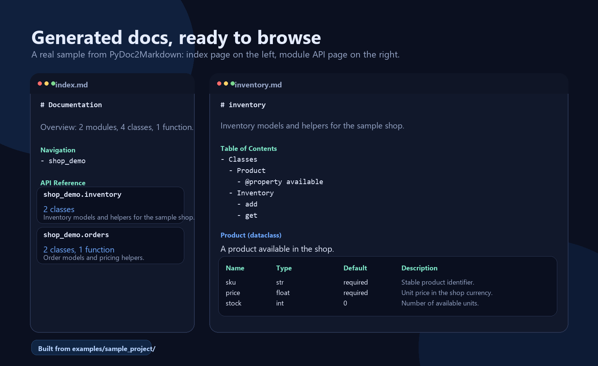
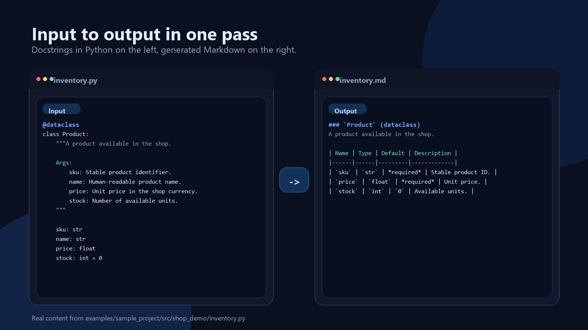

# PyDoc2Markdown

[](https://github.com/f1sherFM/PyDoc2Markdown/actions/workflows/ci.yml)
[](https://codecov.io/gh/f1sherFM/PyDoc2Markdown)
[](https://pypi.org/project/pydoc2markdown/)
[](https://pypi.org/project/pydoc2markdown/)
[](https://github.com/f1sherFM/PyDoc2Markdown/blob/main/LICENSE)

> Convert Python docstrings into clean, structured Markdown documentation.

PyDoc2Markdown turns Python docstrings into plain Markdown that is easy to read,
easy to commit, and easy to publish anywhere. Point it at your source tree and
it can generate module docs, a navigation-ready docs directory, or a maintained
API section inside your README.

It is built for projects that want documentation to stay close to the code
without taking on a full documentation framework. The output works well on
GitHub, GitLab, MkDocs, and any other Markdown renderer.

**What you get:**

- Plain `.md` files instead of a custom docs runtime
- Useful output with almost no setup
- A CLI for day-to-day use and a small library API for automation
- Features that help docs stay current: `--check`, `--prune`, README sync, navigation pages, and `--report`

**A good fit for:**

- Python libraries that want lightweight API docs in the repo
- Internal tools and services that keep docs next to the code
- Projects that want README API sections without manual copy-paste
- Teams that prefer Markdown files over framework-specific documentation stacks

## Table of Contents

- [Why PyDoc2Markdown?](#why-pydoc2markdown)
- [Features](#features)
- [Requirements](#requirements)
- [Installation](#installation)
- [Visual Tour](#visual-tour)
- [Try It In 30 Seconds](#try-it-in-30-seconds)
- [Sample Project](#sample-project)
- [Before And After](#before-and-after)
- [Common Commands](#common-commands)
- [Recipes](#recipes)
- [Quick Start](#quick-start)
  - [CLI Usage](#cli-usage)
  - [Library Usage](#library-usage)
- [CLI Reference](#cli-reference)
- [Configuration](#configuration)
- [Module Filtering](#module-filtering)
- [Source Links](#source-links)
- [README API Sections](#readme-api-sections)
- [Navigation Docs Layout](#navigation-docs-layout)
- [CI Checks](#ci-checks)
- [Library API](#library-api)
- [Supported Docstring Formats](#supported-docstring-formats)
- [Example Output](#example-output)
- [Documentation](#documentation)
- [License](#license)

## Why PyDoc2Markdown?

Documentation generators like **Sphinx** are powerful but often come with
noticeable setup: themes, `conf.py`, extensions, and custom builders to get the
exact output you want. **pdoc** and **mkdocstrings** are lighter, but they still
pull you toward a broader documentation stack.

PyDoc2Markdown takes a different approach: **minimal setup, no framework lock-in,
plain Markdown output.** Point it at a Python project and get structured docs
that work anywhere: GitHub, GitLab, MkDocs, or any Markdown renderer.

- **No `conf.py`** - works out of the box
- **No framework lock-in** - generates plain `.md` files
- **Minimal dependencies** - Jinja2 + docstring-parser
- **Practical defaults** - useful CLI output before you write any config

## Features

- **Docstring parsing** - Extract Google and NumPy style docstrings, with basic reStructuredText field support via `docstring-parser`.
- **Markdown generation** - Produce clean Markdown files with customizable Jinja2 templates.
- **README API sections** - Create or update a generated API reference block in README files, in `summary` or `detailed` mode.
- **Auto-generated index & TOC** - Each module gets a Table of Contents; an `index.md` with package grouping is created automatically.
- **Navigation layout** - Generate a docs entrypoint with package pages and API files under `api/`.
- **Output toggles** - Control built-in TOC, source links, compact sections, class metadata, Public API, attributes, returns, raises, and member visibility from CLI or `pyproject.toml`.
- **CI-friendly checks** - Verify generated docs are up to date with `--check`.
- **Coverage report mode** - Inspect undocumented modules, classes, functions, exports, and parameter docs with `--report`.
- **Managed cleanup** - Preview or remove stale generated Markdown with `--prune` and `--dry-run`.
- **Module filtering** - Include or exclude source files with glob patterns.
- **Parameter defaults** - Show which function arguments are required or optional.
- **Source links** - Link generated classes, functions, and methods back to source code.
- **Package grouping** - Output files are organized into subdirectories matching the package structure.
- **Built-in themes** - Choose between `default` (detailed) and `minimal` themes, or supply your own template.
- **CLI & API** - Use via command line or import as a Python library.
- **Recursive processing** - Scan entire packages in one command.
- **Type-aware** - Respects type hints and annotations.
- **Advanced constructs** - Supports `property`, `classmethod`, `staticmethod`, `dataclass`, `Enum`, `TypedDict`, `Protocol`, `ABC`, `Pydantic`, and `__all__`.

## Requirements

- Python >= 3.10
- Dependencies: [Jinja2](https://jinja.palletsprojects.com/), [docstring-parser](https://github.com/rr-/docstring-parser)
- Optional: [watchdog](https://github.com/argoslabs/python-watchdog) (for `--watch` mode)

## Installation

```bash
# Base installation
pip install pydoc2markdown

# With file watcher support
pip install pydoc2markdown[watch]
```

## Visual Tour

Here is the kind of navigation-first Markdown output the project generates from
the included sample package:



## Try It In 30 Seconds

Clone the repository and run PyDoc2Markdown against the included sample project:

```bash
pydoc2markdown examples/sample_project/src --recursive --nav --readme \
  --readme-path examples/sample_project/README.md \
  -o examples/sample_project/docs
```

That one command updates the sample project's README API block and creates a
navigation-first docs layout you can inspect immediately:

```text
examples/sample_project/
|-- README.md
|-- src/shop_demo/
`-- docs/
    |-- index.md
    |-- shop_demo.md
    `-- api/shop_demo/
        |-- inventory.md
        `-- orders.md
```

## Sample Project

The [sample project](examples/sample_project/) is a tiny shop package with
dataclasses, an enum, typed functions, properties, and Google-style docstrings.
It is the fastest way to understand what PyDoc2Markdown actually produces in a
real repo layout.

You can inspect the whole workflow side by side:

- [source code](examples/sample_project/src/shop_demo/)
- [generated docs index](examples/sample_project/docs/index.md)
- [README API section](examples/sample_project/README.md)

You can also create the same kind of demo project locally:

```bash
pydoc2markdown --demo
```

By default this writes to `pydoc2markdown-demo/`. Use `--demo-output` to choose
another directory. Existing non-empty directories are not overwritten.

## Before And After

This is the same idea in a tighter `input -> output` view:



Start with normal Python code and docstrings:

```python
def calculate_total(items: list[Product], discount: float = 0.0) -> float:
    """Calculate the discounted order total.

    Args:
        items: Products to include in the total.
        discount: Discount ratio between 0 and 1.

    Returns:
        Total price after discount.

    Raises:
        ValueError: If discount is outside the accepted range.
    """
```

PyDoc2Markdown turns it into Markdown with headings, parameter tables, return
types, and raised exceptions:

```markdown
### `calculate_total`

Calculate the discounted order total.

**Parameters:**

| Name | Type | Default | Description |
|------|------|---------|-------------|
| `items` | `list[Product]` | *required* | Products to include in the total. |
| `discount` | `float` | `0.0` | Discount ratio between 0 and 1. |

**Returns:** `float`
Total price after discount.

**Raises:**
- `ValueError`: If discount is outside the accepted range.
```

## Common Commands

Start with the command that matches how you want to publish docs:

| Goal | Command |
|------|---------|
| Generate module docs | `pydoc2markdown src/my_package --recursive -o docs` |
| Generate a docs index and API pages | `pydoc2markdown src/my_package --recursive --nav -o docs` |
| Update the API section in README.md | `pydoc2markdown src/my_package --recursive --readme` |
| Use a custom README section title | `pydoc2markdown src/my_package --recursive --readme --readme-title "Developer API"` |
| Skip private/internal modules | `pydoc2markdown src/my_package --recursive --exclude "tests/*,*/internal/*,*_private.py"` |
| Add GitHub source links | `pydoc2markdown src/my_package --recursive --source-repo user/repo -o docs` |
| Generate a compact docs layout | `pydoc2markdown src/my_package --recursive --compact-sections -o docs` |
| Hide returns and raises in generated docs | `pydoc2markdown src/my_package --recursive --no-show-returns --no-show-raises -o docs` |
| Keep docs focused on exported API | `pydoc2markdown src/my_package --recursive --public-only -o docs` |
| Include private helpers and dunder methods | `pydoc2markdown src/my_package --recursive --show-private-members --show-dunder-members -o docs` |
| Check generated docs in CI | `pydoc2markdown src/my_package --recursive --nav --readme --check -o docs` |
| Print a documentation coverage report | `pydoc2markdown src/my_package --recursive --report` |
| Fail CI when selected report findings exist | `pydoc2markdown src/my_package --recursive --report --fail-on modules,params` |
| Fail CI when overall report coverage drops below a target | `pydoc2markdown src/my_package --recursive --report --fail-under 95` |
| Export the report as JSON | `pydoc2markdown src/my_package --recursive --report --report-format json` |
| Save the report as a CI artifact | `pydoc2markdown src/my_package --recursive --report --report-format json --report-output reports/doc-coverage.json` |
| Print only the report summary in CI logs | `pydoc2markdown src/my_package --recursive --report --report-summary-only` |
| Focus the report on selected categories | `pydoc2markdown src/my_package --recursive --report --report-categories modules,params` |
| Preview stale generated docs cleanup | `pydoc2markdown src/my_package --recursive --prune --dry-run -o docs` |
| Remove stale generated docs | `pydoc2markdown src/my_package --recursive --prune -o docs` |
| Generate one combined Markdown file | `pydoc2markdown src/my_package --recursive --single-file -o docs/api.md` |
| Watch source files while editing | `pydoc2markdown src/my_package --recursive --watch -o docs` |
| Create default pyproject config | `pydoc2markdown --init` |
| Create a local demo project | `pydoc2markdown --demo` |

Use `--theme minimal` for shorter output, or `--template path/to/template.md.j2`
when a project needs custom Markdown.

## Recipes

Here are a few practical ways teams tend to use PyDoc2Markdown.

### Keep API docs in `docs/`

Generate a navigation-ready docs tree for a package:

```bash
pydoc2markdown src/my_package --recursive --nav -o docs
```

This works well when you want browsable Markdown pages in the repository,
MkDocs, or another lightweight docs site.

### Keep a README API block in sync

Update a generated API section without touching the rest of the README:

```bash
pydoc2markdown src/my_package --recursive --readme --readme-path README.md
```

This is a good fit for small libraries that want usage notes and API reference
in one file.

Use `--readme-mode detailed` when you want a richer embedded API section:

```bash
pydoc2markdown src/my_package --recursive --readme --readme-mode detailed
```

### Gate docs in CI

Fail CI when generated docs are missing, stale, or no longer match the source
tree:

```bash
pydoc2markdown src/my_package --recursive --nav --readme --check -o docs
```

Pair this with `--prune` in local development to keep generated docs tidy after
renames and deletions.

### Generate docs only for the public surface

Focus on selected packages and skip internal modules:

```bash
pydoc2markdown src/my_package --recursive \
  --include "api/*,models/*" \
  --exclude "*/internal/*,*_test.py" \
  -o docs
```

This is useful when your source tree is larger than the documentation surface
you actually want to publish.

## Quick Start

### CLI Usage

```bash
# Generate docs for a single file
pydoc2markdown my_module.py -o docs

# Recursively process a package
pydoc2markdown src/my_package --recursive -o docs

# Skip internal and test modules
pydoc2markdown src/my_package --recursive --exclude "tests/*,*/internal/*,*_test.py" -o docs

# Generate a navigation-first docs layout
pydoc2markdown src/my_package --recursive --nav -o docs

# Add GitHub source links next to documented objects
pydoc2markdown src/my_package --recursive --source-repo user/repo -o docs

# Hide the module TOC and use a tighter built-in layout
pydoc2markdown src/my_package --recursive --no-show-toc --compact-sections -o docs

# Trim output sections you do not want in published docs
pydoc2markdown src/my_package --recursive \
  --no-show-public-api \
  --no-show-attributes \
  --no-show-returns \
  --no-show-raises \
  -o docs

# Check whether generated docs are current without writing files
pydoc2markdown src/my_package --recursive --nav --check -o docs

# Print a documentation coverage report
pydoc2markdown src/my_package --recursive --report

# Fail when undocumented modules or missing param docs are found
pydoc2markdown src/my_package --recursive --report --fail-on modules,params

# Fail when overall coverage falls below a target percentage
pydoc2markdown src/my_package --recursive --report --fail-under 95

# Keep CI logs compact while still showing totals and counts
pydoc2markdown src/my_package --recursive --report --report-summary-only

# Focus the report on the categories you care about
pydoc2markdown src/my_package --recursive --report --report-categories modules,params

# Emit machine-readable JSON
pydoc2markdown src/my_package --recursive --report --report-format json

# Save the report as a CI artifact while still printing it to stdout
pydoc2markdown src/my_package --recursive --report \
  --report-format json \
  --report-output reports/doc-coverage.json

# Preview stale generated Markdown files before removing them
pydoc2markdown src/my_package --recursive --prune --dry-run -o docs

# Remove stale generated Markdown files tracked by PyDoc2Markdown
pydoc2markdown src/my_package --recursive --prune -o docs

# Initialize default configuration in pyproject.toml
pydoc2markdown --init
```

### Library Usage

```python
from pathlib import Path
from pydoc2markdown import DocstringParser, MarkdownGenerator, OutputOptions

parser = DocstringParser()
modules = parser.parse(Path("src/my_package"), recursive=True)

generator = MarkdownGenerator(
    theme="default",
    output_options=OutputOptions(show_toc=False, compact_sections=True),
)
generator.generate(modules, output_dir=Path("docs"))
```

## CLI Reference

| Flag | Default | Description |
|------|---------|-------------|
| `source` | *(required unless `--init` is used)* | Path to a Python file or directory to process |
| `--init` | `False` | Create or update `[tool.pydoc2markdown]` in `pyproject.toml` |
| `-o`, `--output` | `docs` / value from `pyproject.toml` | Output directory (or file path when `--single-file` is used) |
| `--recursive` | `False` / value from `pyproject.toml` | Recursively process subdirectories |
| `--include` | `None` | Comma-separated glob patterns for files to include |
| `--exclude` | `None` | Comma-separated glob patterns for files to exclude |
| `--theme` | `default` / value from `pyproject.toml` | Built-in theme: `default` (detailed) or `minimal` |
| `--template` | `None` | Path to a custom Jinja2 template for Markdown generation |
| `--show-toc`, `--no-show-toc` | `True` / value from `pyproject.toml` | Show or hide the module table of contents in built-in output |
| `--show-source-links`, `--no-show-source-links` | `True` / value from `pyproject.toml` | Show or hide built-in source links |
| `--compact-sections`, `--no-compact-sections` | `False` / value from `pyproject.toml` | Use a tighter built-in Markdown layout |
| `--show-class-metadata`, `--no-show-class-metadata` | `True` / value from `pyproject.toml` | Show or hide built-in class metadata like bases and status markers |
| `--show-public-api`, `--no-show-public-api` | `True` / value from `pyproject.toml` | Show or hide the Public API block derived from `__all__` |
| `--show-attributes`, `--no-show-attributes` | `True` / value from `pyproject.toml` | Show or hide built-in attribute and model field tables |
| `--show-returns`, `--no-show-returns` | `True` / value from `pyproject.toml` | Show or hide Returns sections in built-in output |
| `--show-raises`, `--no-show-raises` | `True` / value from `pyproject.toml` | Show or hide Raises sections in built-in output |
| `--show-private-members`, `--no-show-private-members` | `False` / value from `pyproject.toml` | Show or hide private names such as `_helper` and `_debug` |
| `--show-dunder-members`, `--no-show-dunder-members` | `False` / value from `pyproject.toml` | Show or hide dunder members such as `__repr__` |
| `--public-only`, `--no-public-only` | `False` / value from `pyproject.toml` | When `__all__` exists, keep docs focused on that exported top-level API |
| `--single-file` | `False` | Generate a single combined Markdown file; `--output` must be a `.md` or `.markdown` file path |
| `--check` | `False` | Check whether generated docs are up to date without writing files |
| `--prune` | `False` | Remove stale generated Markdown files tracked by PyDoc2Markdown |
| `--dry-run` | `False` | Preview `--prune` results without deleting files |
| `--report` | `False` | Print a documentation coverage report instead of generating Markdown files |
| `--report-categories` | `None` | Comma-separated report categories to include in output: `modules`, `classes`, `functions`, `public_api`, `params` |
| `--report-format` | `text` | Output format for `--report`: `text` or `json` |
| `--fail-on` | `None` | Comma-separated report categories that should return exit code `1`: `modules`, `classes`, `functions`, `public_api`, `params`, or `any` |
| `--fail-under` | `None` | Return exit code `1` when overall report coverage falls below this percentage |
| `--report-output` | `None` | Also write the report output to a file |
| `--report-summary-only` | `False` | Print report totals and counts without listing every finding |
| `--readme` | `False` | Create or update an API reference section in README.md |
| `--readme-path` | `README.md` | Path to the README file updated by `--readme` |
| `--readme-mode` | `summary` / value from `pyproject.toml` | README rendering mode: `summary` or `detailed` |
| `--readme-title` | `API Reference` / value from `pyproject.toml` | Section title used for generated README content |
| `--nav` | `False` | Generate a navigation-first docs layout with API pages under `api/` |
| `--api-dir` | `api` | Directory for API pages when `--nav` is used |
| `--source-link` | `None` | URL template for source links, using `{path}`, `{file}`, and `{line}` |
| `--source-repo` | `None` | GitHub repository shorthand for source links, for example `user/repo` |
| `--watch` | `False` | Watch source files and regenerate docs on change |
| `--demo` | `False` | Create a small demo project and generate docs for it |
| `--demo-output` | `pydoc2markdown-demo` | Directory created by `--demo` |
| `-v`, `--verbose` | `0` | Increase verbosity (`-v` = INFO, `-vv` = DEBUG) |
| `--version` | - | Show version and exit |

**Configuration priority:** CLI flags > `[tool.pydoc2markdown]` in `pyproject.toml` > built-in defaults.

## Configuration

You can initialize default configuration with:

```bash
pydoc2markdown --init
```

This creates or appends a `[tool.pydoc2markdown]` section in `pyproject.toml`.
If the section already exists, it is left unchanged.

You can also set default values manually in your `pyproject.toml`:

```toml
[tool.pydoc2markdown]
output = "docs"
theme = "default"
recursive = true
show_toc = true
show_source_links = true
compact_sections = false
show_class_metadata = true
show_public_api = true
show_attributes = true
show_returns = true
show_raises = true
show_private_members = false
show_dunder_members = false
public_only = false
readme_mode = "summary"
readme_title = "API Reference"
```

Any values set here serve as defaults and can be overridden by CLI flags.

## Module Filtering

Use `--include` and `--exclude` with `--recursive` to control which Python files
are documented:

```bash
pydoc2markdown src/my_package --recursive --exclude "tests/*,*/internal/*,*_private.py"
```

Patterns use standard shell-style globs and are matched against paths relative
to the scanned source root. Patterns without a directory separator also match
file names in any package directory, so `conftest.py` or `*_test.py` work as
convenient basename filters.

When both flags are used, PyDoc2Markdown applies `--include` first and then
removes anything matched by `--exclude`:

```bash
pydoc2markdown src/my_package --recursive --include "api/*,core/*" --exclude "*/generated.py"
```

## Member Filtering

Use member filtering when you want to narrow documentation inside each module,
not just choose which files are parsed.

`--public-only` is the highest-signal option for library projects. When a
module defines `__all__`, PyDoc2Markdown keeps the exported top-level classes
and functions in docs, README summaries, single-file output, navigation docs,
and `--report`:

```bash
pydoc2markdown src/my_package --recursive --public-only -o docs
```

Private names such as `_helper` and `_debug` are hidden by default. Dunder
members such as `__repr__` are hidden by default as well. If you want to expose
those internals in generated docs, opt in explicitly:

```bash
pydoc2markdown src/my_package --recursive \
  --show-private-members \
  --show-dunder-members \
  -o docs
```

These controls affect:

- generated module docs
- navigation docs
- single-file output
- README API sections
- `--report`

That keeps the visible docs surface and the reported coverage surface aligned.

## Source Links

Use `--source-repo` to add GitHub source links next to generated class,
function, and method headings:

```bash
pydoc2markdown src/my_package --recursive --source-repo user/repo -o docs
```

This expands to a GitHub URL template using the `main` branch:

```text
https://github.com/user/repo/blob/main/{path}#L{line}
```

For GitLab, another branch, or a custom host, pass the full template with
`--source-link`:

```bash
pydoc2markdown src/my_package --recursive \
  --source-link "https://gitlab.com/user/repo/-/blob/develop/{path}#L{line}" \
  -o docs
```

Available template variables are `{path}` for the source-root-relative Python
file path, `{file}` for the filename, and `{line}` for the 1-indexed definition
line.

## Output Toggles

PyDoc2Markdown's built-in renderer can be trimmed without writing a custom
template. You can set these toggles per run or keep them in
`[tool.pydoc2markdown]`.

- `show_toc`
- `show_source_links`
- `compact_sections`
- `show_class_metadata`
- `show_public_api`
- `show_attributes`
- `show_returns`
- `show_raises`
- `show_private_members`
- `show_dunder_members`
- `public_only`

For example, this keeps parameter tables but removes Public API, Returns, and
Raises blocks from generated docs:

```bash
pydoc2markdown src/my_package --recursive \
  --no-show-public-api \
  --no-show-returns \
  --no-show-raises \
  -o docs
```

## README API Sections

Use `--readme` to create or update a generated API reference in your README:

```bash
pydoc2markdown src/my_package --recursive --readme
```

By default, PyDoc2Markdown updates `README.md`. Use `--readme-path` to target a
different file:

```bash
pydoc2markdown src/my_package --recursive --readme --readme-path docs/index.md
```

`summary` is the default README mode and is optimized for a lightweight module
overview. It now includes short module summaries, compact counts, and one-line
class/function previews. When a module defines `__all__`, the summary also
prioritizes those exported names as the README-facing public API. When README
generation runs alongside docs generation, module headings also link back to
the generated Markdown pages automatically. For projects with multiple package
groups, summary mode also adds lightweight package sections and uses package
`__init__` docstrings as short intros when available. It also adds an overview
line and quick links for the generated module set. Those quick links point to
generated docs when available, and otherwise fall back to internal README
anchors. Use
`--readme-mode detailed` for a richer embedded API section that reuses the
built-in Markdown renderer without per-module TOCs.

Use `--readme-title` when the generated section should appear under a different
heading:

```bash
pydoc2markdown src/my_package --recursive --readme --readme-title "Developer API"
```

When the file already contains PyDoc2Markdown markers, only the generated block
between the markers is replaced:

```markdown
## API Reference

<!-- pydoc2markdown:start -->
<!-- pydoc2markdown:end -->
```

If the markers are missing, a new `## API Reference` section is appended. If the
README does not exist, it is created.

## Navigation Docs Layout

Use `--nav` when you want a docs directory that is ready to browse from a single
entrypoint:

```bash
pydoc2markdown src/my_package --recursive --nav -o docs
```

This creates a layout like:

```text
docs/
|-- index.md
|-- modules.md
`-- api/
    |-- package.md
    `-- utils.md
```

The root `index.md` links to package landing pages and every generated API page.
Use `--api-dir` to change where module pages are written:

```bash
pydoc2markdown src/my_package --recursive --nav --api-dir reference -o docs
```

## CI Checks

Use `--check` in CI to fail when generated documentation is missing or stale:

```bash
pydoc2markdown src/my_package --recursive --nav --readme --check -o docs
```

The command compares the files PyDoc2Markdown would generate with the files
already on disk. It exits with `0` when docs are current and `1` when any
generated output needs to be updated. It does not write files in check mode.

`--check` works with normal multi-file output, `--nav`, `--single-file`, and
README API sections. It cannot be combined with `--watch`.

## Documentation Coverage Report

Use `--report` when you want a quick documentation audit without writing any
Markdown files:

```bash
pydoc2markdown src/my_package --recursive --report
```

The report prints totals plus findings for:

- modules without docstrings
- classes without docstrings
- functions without docstrings
- undocumented `__all__` exports
- parameters missing descriptions

The text report also includes an overall coverage percentage and per-category
coverage breakdown so you can see where gaps are concentrated.

By default, `--report` is analysis-only and exits successfully when the report
is produced. Use `--fail-on` when you want selected findings to fail CI:

```bash
pydoc2markdown src/my_package --recursive --report --fail-on modules,params
```

Use `--fail-on any` to fail on any non-zero finding category.

Use `--fail-under` when you want to enforce a minimum overall coverage target:

```bash
pydoc2markdown src/my_package --recursive --report --fail-under 95
```

Use `--report-summary-only` when you want compact CI logs that still show
coverage totals and category counts:

```bash
pydoc2markdown src/my_package --recursive --report --report-summary-only
```

Use `--report-categories` when you want to focus the report on a smaller slice
of documentation debt:

```bash
pydoc2markdown src/my_package --recursive --report --report-categories modules,params
```

For automation, JSON output is also available:

```bash
pydoc2markdown src/my_package --recursive --report --report-format json
```

To keep the report as a build artifact, add `--report-output`:

```bash
pydoc2markdown src/my_package --recursive --report \
  --report-format json \
  --report-output reports/doc-coverage.json
```

## Prune Stale Docs

Use `--prune` to remove stale generated Markdown files that were tracked by
PyDoc2Markdown in a previous run but are no longer expected for the current
source tree:

```bash
pydoc2markdown src/my_package --recursive --prune -o docs
```

To preview the cleanup first, add `--dry-run`:

```bash
pydoc2markdown src/my_package --recursive --prune --dry-run -o docs
```

`--prune` only affects generated Markdown files recorded in the PyDoc2Markdown
manifest. It does not try to delete unrelated hand-written Markdown files that
may live in the same docs directory.

## Library API

### DocstringParser

```python
from pathlib import Path
from pydoc2markdown import DocstringParser

parser = DocstringParser()
modules = parser.parse(Path("src/my_package"), recursive=True)
```

### MarkdownGenerator

```python
from pathlib import Path
from pydoc2markdown import DocstringParser, MarkdownGenerator, OutputOptions

# Parse modules
parser = DocstringParser()
modules = parser.parse(Path("src/my_package"), recursive=True)

# Default theme, separate files
gen = MarkdownGenerator(theme="default")
gen.generate(modules, output_dir=Path("docs"))

# Built-in output toggles
gen_tuned = MarkdownGenerator(
    theme="default",
    output_options=OutputOptions(
        show_toc=False,
        compact_sections=True,
        public_only=True,
    ),
)
gen_tuned.generate(modules, output_dir=Path("docs_compact"))

# Minimal theme
gen_min = MarkdownGenerator(theme="minimal")
gen_min.generate(modules, output_dir=Path("docs_minimal"))

# Custom template
gen_tmpl = MarkdownGenerator(template_path=Path("my_template.md.j2"))
gen_tmpl.generate(modules, output_dir=Path("docs_custom"))

# Single combined file
gen.generate_single_file(modules, output_path=Path("docs/README.md"))

# README API section
gen.update_readme(modules, readme_path=Path("README.md"))

# Navigation docs layout
gen.generate_navigation(modules, output_dir=Path("docs"))

# Markdown string for a single module
md_string = gen.generate_string(modules[0])
```

## Supported Docstring Formats

PyDoc2Markdown uses [docstring-parser](https://github.com/rr-/docstring-parser) and supports common structured docstring sections:

| Style | Support | Notes |
|-------|---------|-------|
| **Google** | Full | Args, Returns, Raises, Attributes, Examples |
| **NumPy** | Full | Parameters, Returns, Raises, Attributes, Examples |
| **reStructuredText (reST)** | Basic | Field-style metadata via `docstring-parser`, including `:param:`, `:returns:`, and `:raises:` |

## Example Output

Given this source file:

```python
from pydantic import BaseModel, Field


class User(BaseModel):
    """A user in the system."""

    id: int = Field(description="Unique identifier")
    email: str = Field(default="", description="Email address")
    is_active: bool = True


class UserService:
    """Service for managing users."""

    def get_user(self, user_id: int) -> User:
        """Fetch a user by ID.

        Args:
            user_id: The user's unique identifier.

        Returns:
            The requested User instance.

        Raises:
            ValueError: If the user does not exist.
        """
        ...
```

Running `pydoc2markdown src/users.py -o docs` produces:

```markdown
# users

## Table of Contents

- [Classes](#classes)
  - [`User`](#user)
  - [`UserService`](#userservice)

## Classes

### `User` *(Pydantic)*

A user in the system.

#### Pydantic Fields

| Name | Type | Default | Description |
|------|------|---------|-------------|
| `id` | `int` | *required* | Unique identifier |
| `email` | `str` | `""` | Email address |
| `is_active` | `bool` | `True` | - |

### `UserService`

Service for managing users.

#### Methods

##### `get_user`

Fetch a user by ID.

**Parameters:**

| Name | Type | Default | Description |
|------|------|---------|-------------|
| `user_id` | `int` | *required* | The user's unique identifier. |

**Returns:** `User`

**Raises:**

- `ValueError`: If the user does not exist.
```

For a complete small project, see [examples/sample_project/](examples/sample_project/).
It includes source code, a generated README API section, and a navigation-first
docs layout generated by PyDoc2Markdown. You can also see pre-built
documentation for this repository in [examples/docs/](examples/docs/).

## Documentation

- [Contributing Guide](CONTRIBUTING.md)
- [Project Structure](PROJECT_STRUCTURE.md)

## License

MIT License - see [LICENSE](LICENSE) for details.
